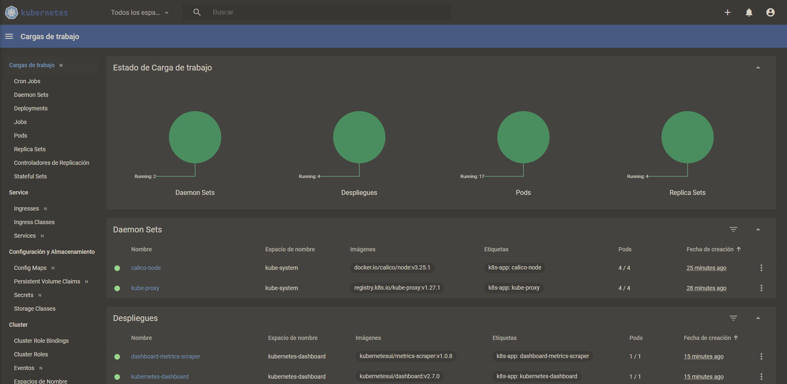

# Kubernetes deployment

Is done via...


# Connection

## dns resolution

Add the following entry to your /etc/hosts file

```
34.65.159.24 master01
```

# Monitoring

Kubernetes dashboard is deployed. To access it, execute:

```
kubectl -n kubernetes-dashboard port-forward svc/kubernetes-dashboard 8443:443
```

Then, user your browser to navigate to `https://localhost:8443/`

## Access dashboard

To access the dashboard, currently only [access tokens are supported](https://github.com/kubernetes/dashboard/blob/master/docs/user/access-control/creating-sample-user.md)

For this reason, the `Token` option needs to be used to login and a the result of executing this command should be used as token.

`kubectl -n kubernetes-dashboard create token admin-user`



# Logging

## Elasticsearch
Elasticsearch is deployed to be the unified log facility. To get the password for the `elastic` username , run:

```
kubectl -n logging-system get secret es-logging-es-elastic-user -o go-template='{{.data.elastic | base64decode}}'
```

You can access the elasticsearch service by port-forwarding to it:

```
kubectl -n logging-system port-forward service/es-logging-es-http 9200
```

You will be able to interact with elasticsearch by any client (including your internet browser and `curl`) with: `https://localhost:9200` endpoint

## Kibana
Kibana can be used for a more friendly experience interacting with elasticsearch. To access the deployed Kibana, run:

```
kubectl port-forward service/kibana-kb-http 5601

```
Then, proceed to your broswer and go to:
https://localhost:5601/
```

You should be able to access kibana using your web browser if you go to: `https://localhost:5601/`

Run the following command to get the secret for the elastic user and loging to the UI:

```
kubectl -n logging-system get secret es-logging-es-elastic-user -o=jsonpath='{.data.elastic}' | base64 --decode; echo
```

# Google Artifact Registry

A google artifact registry is created to enable uploading and downloading build images. Nodes in the project by default, are able to download images from the repository.
To upload images, an account with enough permissions is required (to be used in ci/cd or by admins).

